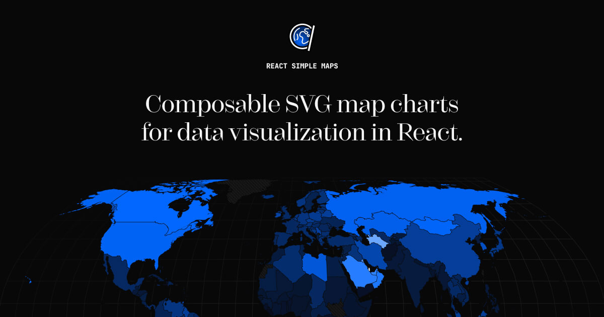

# React Simple Maps

   

[](https://www.react-simple-maps.io)

Compose map charts the same way you would write any other layout. Fully typed mature api with high test coverage, built on d3-geo and topojson.

Read the [docs](https://www.react-simple-maps.io/docs/getting-started/) to get started with React Simple Maps.

### Why

`React Simple Maps` aims to make working with svg maps in react easier. It handles tasks such as panning, zooming and simple rendering optimization, and takes advantage of parts of [d3-geo](https://github.com/d3/d3-geo) and topojson-client instead of relying on the entire d3 library.

Since `React Simple Maps` leaves DOM work to react, it also plays nicely with other react component libraries.

### Install

```bash
$ npm install react-simple-maps
```

### Usage

`React-simple-maps` exposes a set of components that can be combined to create svg maps with markers and annotations. In order to render a map you have to provide a reference to a valid TopoJSON file. You can find examples of TopoJSON files on the [react-simple-maps website](https://www.react-simple-maps.io/docs/map-files). To learn how to make your own topojson maps from shapefiles, please read ["How to convert and prepare TopoJSON files for interactive mapping with d3"](https://hackernoon.com/how-to-convert-and-prepare-topojson-files-for-interactive-mapping-with-d3-499cf0ced5f).

```jsx
import { ComposableMap, Geographies, Geography } from "react-simple-maps"

// url to a valid TopoJSON file
const geoUrl = "/path/to/my-topojson-file.json"

const SampleMap = () => {
  return (
    <ComposableMap>
      <Geographies geography={geoUrl}>
        {({ geographies }) =>
          geographies.map((geo) => (
            <Geography key={geo.rsmKey} geography={geo} />
          ))
        }
      </Geographies>
    </ComposableMap>
  )
}
```

The above will render a world map using the [equal earth projection](https://observablehq.com/@d3/equal-earth). You can read more about this projection on [Shaded Relief](http://shadedrelief.com/ee_proj/) and on [Wikipedia](https://en.wikipedia.org/wiki/Equal_Earth_projection).

### Map files

React-simple-maps does not restrict you to one specific map and relies on custom map files that you can modify in any way necessary for your project. This means that you can visualise countries, regions, and continents at various levels of complexity, as long as they can be represented using GeoJSON/TopoJSON.

In order for this to work properly, you will need to provide these valid map files to React Simple Maps yourself. Read our guide on [map files](https://www.react-simple-maps.io/docs/map-files). We also offer some testing files in the downloads section so you can get started quickly.

### V3 Docs

If you are using React Simple Maps v3, you can find the old documentation at [v3-react-simple-maps.io](https://v3.react-simple-maps.io/).

### License

MIT licensed. Copyright (c) Richard Zimerman 2017. See [LICENSE.md](https://github.com/zcreativelabs/react-simple-maps/blob/master/LICENSE) for more details.
